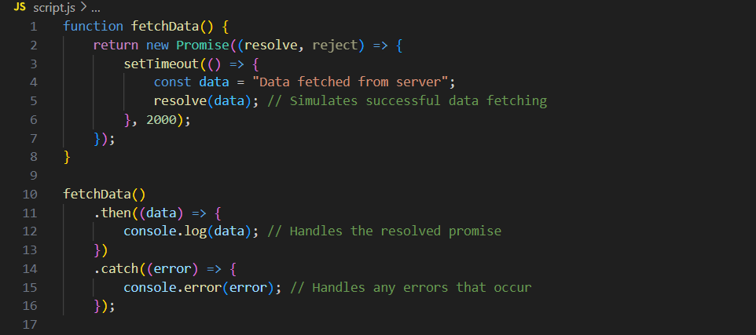

# Advanced_JavaScript
## Overview and Introduction 
### Pros of JavaScript

  

### Callbacks and Asynchronous Tasks

- When performing sychronous tasks, we have to wait for each task to complete before moving on to the next which causes blocking.
- When performing Asynchronous Tasks, it allows us to proceed to the next task without waiting for the prior one to finish.


- Asynchtonous code commonly employs callbacks.


## Advanced JavaScript
### ES6+ features(let, const, arrow functions, template literals)

- brought significant enhancements to JavaScript and makes the language more powerful, readable, and easier to work with.

#### 1. let and const:
#### Block-Scoped Variables:
- They allow you to declare variables that are scoped to the block(e.g., within a function, loop, or conditional statement) instead of the entire function or global scope.
- they help prevent issues like variable leakage and makes your code easier to debug and maintain.

#### let:

- used for variables that may need to be reassigned such as in loops or situations where the value of the variable changes over time.
- unlike var, which is function-scoped, it ensures that the variable is only accessible within the block where it's defined.

#### const: 

- used for variables that should not be reassigned after they are initialized. This is ideal for constants or values that should remain fixed throughout the program.
- While const prevents reassignment, it doesnt make the value immutable. For objects and arrays declared with const, the properties and elements can still be modified.

#### 2. Arrow Functions:

#### Concise Syntax:

- Arrow functions provide a shorter and more concise syntax for writing functions. They use the => syntax and omit the need for the function keyword.
- They are particularly useful for writing simplie one-line functions, such as in array methods like ```map```, `filter`, or `reduce`.

#### Lexical this:

- One of the key differences between traditional functions and arrow functions is how they handle the ```this``` keyword.
- Arrow functions inhert  `this` from the surrounding context, which eliminates common issues with `this` in callback functions, particularly in object oriented programming.


#### 3. Template Literals:

#### Enhanced String Interpolation:

- They provide a more flexible way to create strings, allowing for embedded expressions and multi-line strings without the need for concatenation.
- Defined using backtick(`) instead of single or double quotes.

#### Expressions Inside Strings:

- You can embed expressions inside template literals using `${}` syntax
- Allows you to directly insert variables, expressions, od function results into strings, making the code more readable and easier to maintain.

#### Multi-Line Strings:

- Template literals allow you to write multi-line strings directly in the code without using escape sequences (\n).
- Particularly usefull for creating formatted text or code block.

#### 4. Other Notable ES6+ Features:

#### Default Parameters:

- ES6 allows you to set default values for function parameters, making your functions more robust and reducing the need for additional checks.

#### Destructuring:

- Destructuring enables you to unpack values from arrays or properties from objects into distinct variables, simplifying the extraction of data from complex structures.

#### Spread and Rest Operators:

- The spread operator (...) allows you to expand elements of an array or object. It's useful for copying arrays, combining objects, or passing multiple elements as arguments.
- The rest operator, also using (...), collects multiple elements into an array, making it easier to handle function parameters or gather the remaining elements in an array.

#### 5. Significance of ES6+ in Modern Development

#### Code Readability:

- ES6+ features contribute to cleaner, more readable, and more concise code, which is easier to write and understand.

#### Performance and Efficiency:

- These features often result in more effecient and performant JavaScript code. e.g., `const` helps in preventing accidental reassignment, and arrow functions simplify the handling of this.

#### Modern JavaScript Ecosystem:

- Understanding and using ES6+ features is essential for working with modern JavaScript frameworks and libraries(like React, Angular, or Vue) as well as for writing more maintainable and scalable code in general.

### Asynchronous JavaScript (callbacks, promises, async/await)

- It is a powerful concept that allows your code to perform tasks without blocking the main thread. This is essential for handling operatioins like fetching data from a server, reading files, or executing time-consuming processes. 
- Helps you write more efficient and responsive web applications.

#### 1. Callbacks: 
 - It is a function that is passed as an argument to another function and is executed after the completion of a specific task. 
 - It is one of the simplest ways to handle asynchronous operations in JavaScript
 - they are commonly used in scenarios like event handling or when performing asynchronous operations such as reading a file or making an API call.


- In this example, fetchData simulates fetching data from a server. Once the data is fetched, it calls the displayData function to display the data.

##### Drawback:
- Callback Hell: as applications grow, deeply nested callbacks can lead to complicated, hard-to-read code, known as "callback hell"

#### 2. Promises:

- A promise is an object that represents the eventual completion(or failure) of an asynchronous operation. It allowsyou to attach callbacks to handle the result or error, providing a cleaner and more manageable way to work with asynchronous code.

##### States of a Promise:
- Pending: Initial state, neither fulfilled nor rejected.
- Fulfilled: Operation completed successfully, and the promise has been resolved value.
- Rejected: Operation failed, and the promise has a reason for the failure.

##### Chaining with .then() and .catch():

- Promises allow you to chain operations using `.then()` fir handling succes and `.catch()` for handling errors, making the code more readable



- `fetchData` returns a promise that resolves with the data after 2 seconds. The `.then()` method is used to handle the resolved data, and `.catch()` would handle any errors if they occurred.

##### Advantage:

- Promises improve code readability and make it easier to handle complex asynchronous operations without falling into callback hell.

#### 3. Async/ Await:

- async and await are syntactic sugar built on top promises, providing a more intuitive way to write asynchronous code. With async/await, you can write asynchronous code that looks and behaves like synchronous code, making it easier to follow and debug.

##### Usage:

- The async keyword is used to declare a function that returns a promise.
- The await keyword is used inside an async function to pause execution until the promise is resolved or rejected, making the code appear linear.

 

- In this example, `fetchData` is an `async` function that uses `await` to wait for wait for the promise to resolve. The code inside the `async` function executes in a more synchronous-like manner, which is easier to read and understand. 

#### 4. Why Asynchronous JavaScript Matters:

##### Non-Blocking Code:

- Asynchronous operations allow JavaScript to perform tasks like fetching data from an API, reading files, or waiting user input without freezing the entire application which is crucial for creating smooth, responsive user experiences.

##### Scalability:

- Understanding and using asynchrobous patterns(callbacks, promises, async/await) is essential for building scalable applications that can handle multiple tasks simultaneously.

##### Modern JavaScript Development:

- Asynchronous JavaScript is fundamental in modern web development, especially when dealling with API calls, real-time data updates,or any scenario where operations take time to complete.

### Error handeling (try-catch)

- it is a crucial aspect of programming, allowing you to manage and respond to unexpected issues that arise during code execution. In JavaScript, the `try-catch` statement provides a structured way to handle errors, ensuring that your code can recover gracefully from failures rather than crashing or causing unintended behavior.


#### 1. Importance of Error Handling:

1. Robust Applications:
- Proper error handling helps you create applications that are more robust and user-friendly. When errors are anticipated and managed, the application can continue running or provide meaningful feedback to the iser instead of failing silently or abruptly.

2. Debugging and Maintenance:

- Error handling also aids in debugging and maintaining code by providing clear and informative error messages, making it easier to identify and fix issues.

#### 2. The try-catch Statement:

1. Structure:
- It allows you to test a block of code for errors `(try block)`  and define a response if an error occurs `(catch block)`. If an error is thrown within the `try` block, execution immediately jumps to the `catch` block. 

2. Syntax:

- it involves a `try` block followed by one or more `catch` blocks, and optionally, a `finally` block


##### example:


1. Explanation:
- `try Block:` Contains the code that might throw an error, but in this case, it checks if b is zero befor performing the division.
- `throw Statement:` Manually throws an error if b is zero, passing a custom error message. 
- `catch Block:` Catches the error thrown in the try block and handles it by logging the error message to the console.
- `finally Block:` Executes regardless of whether an error was thrown or not. It's often used for cleanup tasks.

#### 4. Common Use Cases for try-catch:

1. Handling External Resources:

- When working with external resources like files, databases, or network requests, errors can occur due to issues like connectivity problems or missing files. `try-catch` allows you to handle these situations gracefully.

2. Validating User Input: 
- If your code expects user input, you might want tot catch errors when the input doesnt meet the expected format or value range, preventing your application from crashing

3. Debugging and Logging:
- `try-catch` can be used to log errors in a centralized manner, making it easier to identify and fix bugs during development and testing.

#### 5.  Best Practices for Error Handling:
 
 1. Specific Error Handling:

 - Always aim to catch specific errors and provide appropriate responses. Avoid catching generic errors unless absolutely necessary, as it can hide underlying issues that need attention.

2. Graceful Degradation:

- Design your error handling in a way that allows your application to continue functioning, possibly in a reduced capacity, rather than failing completely.

3. Use `finally` for cleanup:
- The `finally` block is useful for performing cleanup tasks, such as closing diles or reasing resources, regardless of whether an error occurred or not.

4. Avoid Silent Failures:
- While it might be tempting to catch errors and do nothing, silent failures can lead to difficult to debug issues. Always provide some feedback, either by logging the error or alerting the user.

#### 6. Error Handling with Async/Await:

1. Handling Errors in Asynchronous Code:

- When using `async/await`, you can wrap your asynchronous code in a `try-catch` block to handle errors that might occur during the asynchronous operation.


- in this example, `try-catch` is used to handle any errors that might occur during the fetch operation, such as network issues or invalid responses.


## Introduction to Node.js

### Setting up Node.js environment

#### 1. Overview of Node.js:

1. What is Node.js?
- an open-source, cross-platform runtime environment that enables JavaScript to run outside the browser, primarily on the server. It uses an event-driven, non-blocking I/O model, making it efficient and suitable for building scalable network applications.

2. Why use Node.js?

- its ability to handle multiple connections simultaneously with high efficiency makes it a popular choice for developers.

#### 2. Verify installation: 

1. Open your terminal
2. node -v (Displays the installed version of Node.js)
3. npm -v (Displays the installed version of npm)

#### 3. Set Up a new Project:

- Create a new directory within the terminal


- Initializa a new Node.js project which creates a `package.json` file in your project directory that will manage your project 


#### 4. Install Dependencies
- Use npm to install any reuired packages for your project. e.g installing Express.js framework:


#### 5. Create and Run a Simple Node.js

- Create a new JavaScript file (index.js) in your project directory: 


- Run the script using Node.js: 


- Open your browser and navigate to http://127.0.0.1:3000/ to see your Node.js server in action. 

### Basic modules (HTTP, FS)

#### 1. HTTP Module:

1. Purpose:
- The HTTP module allows you to create and manage web servers in Node.js. It provides the tools needed to handle requests and responses, enabling you to build server-side applications that interact with users over the web.

2. Key Features:
- Creating a Server: The HTTP module makes it easy to create a web server that listens for and responds to incoming HTTP requests.
- Handling Requests and Responses: You can define how your server should respond to different types of HTTP requests 
- Handling Requestis ans Responses: You can define how your server should respond to different types of HTTP requests(e.g, GET, POST) and manage the data exchanged between the server and clients.

3. Common Use Cases:

- Building web servers, APIs, and any application that requires interaction over the internet.
- Serving HTML pages, handling form submissions, abd providing data response to client requests.

#### 2. FS(File Syestem) Module:

1. Purpose:
- it provides functionalities to interact with the file system on your server. It allows you to read, write, delete, and manipulate files and directories directly from your Node.js application.

2. Key  Features:

- File Operations: You can read from and write to files, create new files and directories, and delete or rename them.
- Synchronous and Asynchronous Methods: The FS module provides both synchronous and asynchronous methods for file operation, allowing you to choose between blocking code execution.

3. Common Use Cases:
- Reading and serving static files(like HTML, CSS, or images) in a web application.
- Logging data to file, creating and managing configuration files, or processing data stored in files.

### Building a simple server
#### 1. Overview of Building a Simple Server:

1. What is a Server?
- an application that listens for requests over a network, typically the internet, and sends back responses. In the contect of web development, a server might deliver HTML pages, handle API requests, or manage data. 

2. Why build a Simple Server?
- It helps you understand how web applications work under the hood. It's a stepping stone to more complex applications like RESTful APIs, real-time applications, and full-fleged web services.

#### 2. Steps to Build a simple server

##### 1. Overview of Building a Simple Server:

1. What is a Server? 
- It is an application that listens for requests over a network, typically the internet, and sends back responses. In context of web development, a server might deliver HTML pages, handle API requests, or manage data.

2. Why build a simple server?
- It helps you understand how web applications work under the hood. It's a stepping stone to more complex applications like RESTful APIs, real-time applications, and full-fledged web services.

#### 2. Steps to Build a simple Server:
##### 1. Set up your environment:

- Ensure Node.js is installed on your system.

##### 2. Create a new project directory:

- Create a new directory for your project and naviget into it using your terminal:


##### 3. Initialize the project:
- initialize a new Node.js project by running the following command which creates a package.json file, which will manage your project's dependencies and scripts:


##### 4. Create a basic server script:
- Create a new JavaScript file named `server.js`


- Open server.js in your favorite text editor and write the following code:


- Explanation:

http.createServer(): Creates a new HTTP server.
res.statusCode: Sets the HTTP status code of the response (200 means OK).

res.setHeader('Content-Type', 'text/plain'): Sets the content type of the response to plain text.

res.end('Hello, World!\n'): Ends the response and sends "Hello, World!" to the client.

server.listen(port, hostname): Binds the server to a specific port and IP address, allowing it to listen for incoming requests.

##### 5. Run the Server:

- Start your server by running the following command in your terminal


- You should see a message like: Server running at http://127.0.0.1:3000/.

##### 6. Test the Server:

- Open your web browser and navigate to http://127.0.0.1:3000/. You should see the message "Hello, World!" displayed on the page.

#### 3. Expanding Your Server:

##### Serve HTML Files:

Instead of serving plain text, you can serve an HTML file by reading it from the filesystem using the FS module and sending it as a response.

##### Handle Different Routes:

Expand your server to handle different routes, such as /about or /contact, by checking the req.url property and responding accordingly.


##### Adding Dynamic Content:

Use template engines or dynamic data to serve content that changes based on the user’s request or data from a database.


